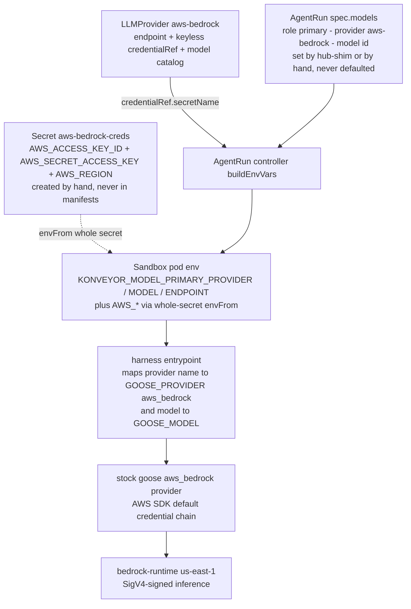

# Bedrock wiring: how a run's model calls reach AWS

How model selection and AWS credentials travel from cluster objects into a
goose process signing SigV4 requests to `bedrock-runtime`. Companion to
[harness-mental-model.md](harness-mental-model.md) (what the #53 harness does
around the model calls) and [quarkus-demo-flow-and-design.md](quarkus-demo-flow-and-design.md)
(the full env contract). Bare paths are this repo; `ACMAIN/...` paths are the
`agentic-controller` checkout, same shorthand as the quarkus doc.

The one-sentence version: **nothing we wrote speaks Bedrock or SigV4 — stock
goose does; the platform's entire job is delivering three `AWS_*` env vars and
two `GOOSE_*` names into the pod, and every seam in that delivery is a naming
convention, not a typed contract.**

> **Post-#100 update (2026-08-05).** Upstream merged the Gateway rename
> (konveyor/agentic-controller#100): `LLMProvider` is now `Gateway` — one
> CR = one provider/model — and the naming conventions below are RETIRED:
> - the CR **name** no longer doubles as the goose provider id; the new
>   required `spec.provider` field ("aws-bedrock") is injected as
>   `KONVEYOR_LLM_PROVIDER` and the entrypoint maps it to `aws_bedrock`.
> - env vars are `KONVEYOR_LLM_{PROVIDER,MODEL,ENDPOINT,API_KEY}`
>   (harness keeps `KONVEYOR_MODEL_PRIMARY_*` as fallbacks).
> - `spec.models[]`/role selection is gone: `AgentRun.spec.gateway` picks a
>   Gateway, and the controller defaults it when the Agent declares exactly
>   one. `status.discoveredModels` is gone too.
> The keyless whole-Secret `envFrom` credential path is unchanged. The
> chain below is kept as written for the pre-#100 world; re-map names
> accordingly.

## 1. The chain

1. **Secret** — `aws-bedrock-creds` in `konveyor-agents`, holding the SigV4
   triple under its literal AWS env-var names
   ([deploy/roks/README.md:156-160](../deploy/roks/README.md)). Created by
   `kubectl/oc create secret`; no manifest ever contains it.
2. **LLMProvider** — named exactly `aws-bedrock`, endpoint
   `https://bedrock-runtime.us-east-1.amazonaws.com`, `credentialRef` to the
   Secret with **no `key`** (keyless = "the whole Secret is the credential",
   upstream #34), plus the model catalog with `tier: primary/efficient`
   (adapted from [manifests/goose-bedrock.yaml](../manifests/goose-bedrock.yaml)).
   The controller's Ready check only verifies the Secret is non-empty and
   probes the endpoint **unauthenticated** — a multi-var credential has no
   bearer token to send (`ACMAIN/internal/controller/llmprovider_controller.go:106-135,230-249`).
3. **Run** — `spec.models: [{role: primary, provider: aws-bedrock, model:
   us.anthropic.claude-sonnet-4-5-20250929-v1:0}]`. The controller defaults
   nothing; omitting models validates fine and crash-loops the pod later. The
   hub-shim injects this on create from the Agent's first provider's
   primary-tier model ([packages/hub-shim/src/server.ts:666-712](../packages/hub-shim/src/server.ts));
   kubectl-created runs set it by hand
   ([deploy/roks/runs/coolstore-run-roks.yaml:15-18](../deploy/roks/runs/coolstore-run-roks.yaml)).
4. **Controller → pod env** — `buildEnvVars` emits
   `KONVEYOR_MODEL_PRIMARY_{PROVIDER,MODEL,ENDPOINT}` and resolves the
   provider's credential: a **keyed** credentialRef becomes
   `KONVEYOR_MODEL_PRIMARY_API_KEY` (OpenAI-style, useless for SigV4); a
   **keyless** one `envFrom`s the entire Secret, so the pod sees `AWS_*`
   under their own names (`ACMAIN/internal/controller/agentrun_controller.go:469-506`).
   `run.spec.envFrom` is appended last, so user-supplied sources win duplicate
   keys (`:382-387`).
5. **Harness → goose env** — both images translate the platform names to
   goose's names (see §2) and start goose with the pod's environment
   inherited, which is how `AWS_*` reaches the model client.
6. **goose → Bedrock** — `GOOSE_PROVIDER=aws_bedrock` selects goose's stock
   Bedrock provider, which uses the AWS SDK default credential chain: reads
   `AWS_ACCESS_KEY_ID`/`AWS_SECRET_ACCESS_KEY`/`AWS_REGION` from env and
   SigV4-signs calls to `bedrock-runtime`, invoking the cross-region
   inference-profile model id verbatim.

## 2. Two images, one contract

Both consume the same `KONVEYOR_MODEL_PRIMARY_*` env; they differ in how the
translation happens.

| | POC image ([harness-goose/](../harness-goose/)) | #53 image (`ACMAIN/images/agent-base` + `agent-java`) |
|---|---|---|
| goose binary | `aaif-goose/goose` **fork**, pinned `v1.39.0` for plain-HTTP ACP — the self-signed-TLS default landed later ([Dockerfile:1-19](../harness-goose/Dockerfile)) | **stock** `block/goose` `v1.45.0` (`Containerfile:39-49`) |
| entrypoint | 108-line shell script: clone repo param, write `.goosehints`, fold skills, `exec goose serve --host 0.0.0.0 --port 4000` ([entrypoint.sh](../harness-goose/entrypoint.sh)) | `migration-harness` Go binary: Hub resolve, clone, ground, watch, commit, push (see [harness-mental-model.md](harness-mental-model.md)) |
| provider mapping | substring match on the CR name: `*bedrock*` → `aws_bedrock` (`entrypoint.sh:46-55`) | name normalization: lowercase + `-`→`_`, so `aws-bedrock` → `aws_bedrock` (`ACMAIN/harness/internal/goose/lifecycle.go:168-171`) |
| Bedrock-specific code | one startup **warning** if `AWS_ACCESS_KEY_ID` is missing (`entrypoint.sh:57-59`) | **none at all** — `providerEnv` has cases for anthropic/openai/google/vertex and none for bedrock; creds flow purely by `os.Environ()` inheritance (`lifecycle.go:161-217`) |
| missing model env | serves anyway, goose fails later | **fatal at startup** (`ACMAIN/harness/internal/config/config.go:28-50`) |
| OpenShift random-UID | n/a (ran as root on minikube) | `HOME=/home/harness` pinned in the image, uid 1001 gid 0 (`Containerfile:53-61`) |

## 3. The load-bearing naming conventions

Everything that makes this work is convention. Each one is a seam that fails
silently if renamed — and each is evidence for the missing upstream harness
contract (issue #22 / #53 discussions):

- **The LLMProvider CR name IS the goose provider id.** The provider string
  the harness receives is the CR *name*. `aws-bedrock` works because it
  normalizes to goose's `aws_bedrock`; name the CR `bedrock-prod` and the #53
  harness hands goose a nonexistent provider. The intended contract — the
  `konveyor.io/goose-provider` annotation on the LLMProvider
  ([manifests/goose-bedrock.yaml:10-13](../manifests/goose-bedrock.yaml)) —
  is read only by the retired dev simulator
  ([simulate-controller.ts:139](../packages/agentrun-client/dev/simulate-controller.ts));
  neither real image looks at it.
- **The Secret's keys are the API.** Keyless envFrom means the Secret's data
  keys land in the pod verbatim, so they must literally be
  `AWS_ACCESS_KEY_ID`/`AWS_SECRET_ACCESS_KEY`/`AWS_REGION` for the AWS SDK
  chain to find them. Nothing validates this; get a key name wrong and the
  provider still reports Ready (the probe is unauthenticated), the pod still
  starts, and goose fails at first inference.
- **`spec.endpoint` is decorative for Bedrock.** It drives the Ready
  reachability probe and nothing else: the #53 harness forwards endpoints
  only for anthropic/openai (`lifecycle.go:206-216`), and goose's Bedrock
  client derives its endpoint from `AWS_REGION`. Change the endpoint region
  without changing the Secret's `AWS_REGION` and traffic keeps going to the
  old region.
- **Keyed credentialRef is a footgun for Bedrock.** The checked-in
  [manifests/goose-bedrock.yaml:16-18](../manifests/goose-bedrock.yaml) still
  uses `key: AWS_ACCESS_KEY_ID` — that injects only the access-key id as an
  API-key-style var, which SigV4 can't use. In that configuration the working
  credential path was the hub-shim's own optional whole-secret envFrom
  (`server.ts:703-710`), the pre-#34 fallback. The ROKS deploy drops the
  `key` (keyless), which is the correct form; the manifest should catch up.
- **Models are never defaulted.** The controller turns `spec.models` into env
  but refuses to choose one. Every creation path must inject models —
  the hub-shim for gateway runs, a human for kubectl runs — or the run
  crash-loops at harness startup (see the quarkus doc's gotcha table).

## 4. So did we roll our own hacky image?

Verdict: **thin adapter around stock components, hacky exactly where upstream
has no contract.** For Bedrock specifically nothing was rolled: zero AWS,
SigV4, or Bedrock client code exists anywhere in either repo — stock goose
does all of it. What we own is packaging and glue: a Dockerfile and a shell
entrypoint (POC), or the migration-harness binary (#53), translating the
controller's env contract into goose's. That translation layer is the
irreducible job of a harness; any runtime (claude-code, aider) would need the
same shim. The genuinely hacky parts are the conventions in §3 plus the POC's
fork-pinned goose — and those are less accidents than a to-do list for the
upstream harness/provider contract.

## 5. Verified runs

This chain is not theoretical — it carried the real demos:

- minikube POC: `migration-analyzer-goose` chat runs via the gateway.
- dylan-mta: full assess→remediate→validate workload E2E (2026-07-30),
  Sonnet 4.5 on Bedrock.
- ROKS: full stack including run `fork-w8vfb`'s real push to the coolstore
  fork ([deploy/roks/README.md](../deploy/roks/README.md)).

Models exercised: `us.anthropic.claude-sonnet-4-5-20250929-v1:0` (primary
tier) and `global.anthropic.claude-haiku-4-5-20251001-v1:0` (efficient tier),
both cross-region inference profiles.
