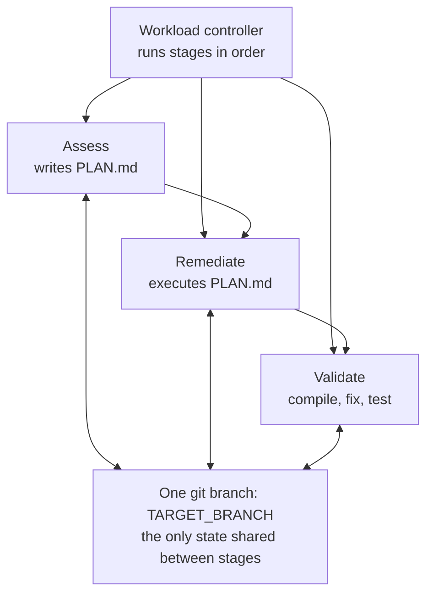
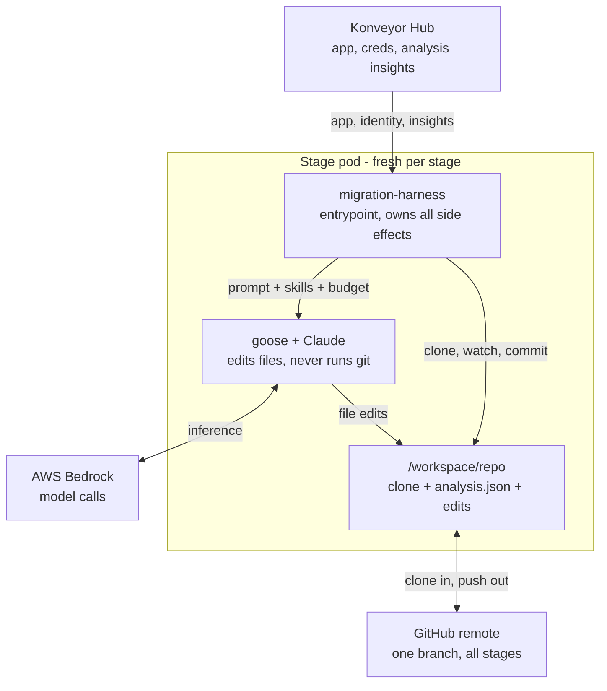
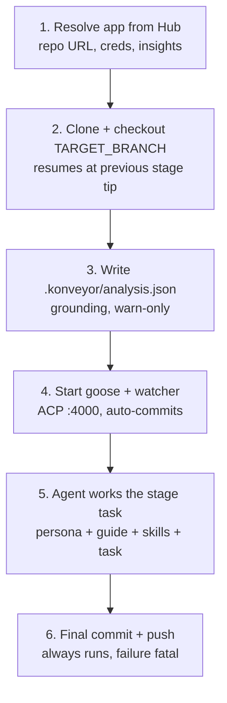

# Harness mental model: one end-to-end workload run

How the PR #53 `migration-harness` operates and what it touches across a three-stage
`AgentWorkloadRun`. Companion to [quarkus-demo-flow-and-design.md](quarkus-demo-flow-and-design.md),
which carries the full code-level walkthrough, and [bedrock-wiring.md](bedrock-wiring.md),
which traces how model selection and AWS credentials reach goose; file references below
(`harness/...`, `internal/controller/...`) are paths in the #53 tree using that doc's shorthand.

Scope note: this describes the **#53 self-serving harness** (the one baked into
`quay.io/konveyor/agent-java:dev` and verified on run `fork-w8vfb`) composed with the
**#36 workload controller**. The `ACMAIN/harness/` tree is the old pre-#53 harness
(`GIT_TARGET_BRANCH`, CLI-arg request) — ignore it.

> **Post-#100/#80 update (2026-08-05).** Upstream renamed
> AgentWorkload→AgentWorkflow (#80: `workflowRef`, `KONVEYOR_WORKFLOW_GUIDE`
> instead of `KONVEYOR_WORKLOAD_INSTRUCTIONS`, `KONVEYOR_WORKFLOW_STAGE[_COUNT]`)
> and LLMProvider→Gateway (#100: single-model Gateways, `KONVEYOR_LLM_*`
> env, `spec.gateway` selection with single-gateway defaulting). Mentally
> substitute those names below; the mechanics are otherwise unchanged.

The one-sentence version: **the harness is a self-serving git-and-Hub chauffeur — it
fetches context in, hands the agent a prompt and a clone, and continuously ships
whatever the agent writes back out to the shared branch, which is the only thing
connecting the stages.**

## 1. The end-to-end run

A workload run is three sequential pods stitched together by a git branch.

The controller side is deliberately dumb (`agentworkloadrun_controller.go:305-343`):

- `AgentWorkloadRun.spec` is **immutable** (CEL `self == oldSelf`) and won't start
  until the workload is Ready (all stage Agents Ready).
- Strictly sequential: current stage = first non-Succeeded child `AgentRun`; stage
  success = child AgentRun Succeeded = Sandbox `Finished=True/PodSucceeded`
  (`agentrun_controller.go:597-628`).
- Any stage failure fails the whole run immediately — **no retries**
  (`agentworkloadrun_controller.go:250-262`).
- Each stage AgentRun gets `models`/`params`/`envFrom` copied identically from the
  workload run, plus `env` = `KONVEYOR_WORKLOAD_INSTRUCTIONS=<guide>` followed by
  `pbRun.spec.env` verbatim — the only channel for `HUB_BASE_URL`, `APP_ID`,
  `TARGET_BRANCH`, `HUB_TOKEN`.
- Each stage pod is brand new with a fresh 10Gi emptyDir at `/workspace`. There is
  no PVC and no status-file chaining: each stage's harness pushes to
  `TARGET_BRANCH`, and the next stage's clone lands on that tip.

## 2. Inside one stage pod

The harness sits between everything. The agent never touches the Hub, git, or
credentials.

Boundary discipline is the mental model:

- The harness is the container ENTRYPOINT (`["migration-harness"] CMD ["run"]`, no
  command/args override from the controller) and owns every side effect: Hub API
  calls, git clone/commit/push, credential handling, launching goose.
- After resolving the app it strips creds from the git remote URL and calls
  `hub.ClearEnv()` to unset `HUB_BASE_URL`/`HUB_TOKEN`/`APP_ID`
  (`main.go:85`, `hub/client.go:70-74`) — goose never sees Hub coordinates or
  credentials.
- Skills at `/opt/skills` reach the model **only as prompt text**: every
  `/opt/skills/*/SKILL.md` is concatenated into the prompt (`main.go:197-220`).
  There is no skill runtime. Zero skills on disk is fatal.
- goose gets one ACP session (`ws://127.0.0.1:4000/acp`) with cwd = the clone, no
  MCP servers (`goose/lifecycle.go:38-82`).

## 3. Harness lifecycle within a stage

What `runStage` (`harness/cmd/migration-harness/main.go:45-186`) does, in order:

1. **Resolve** — given only `HUB_BASE_URL` + `APP_ID` (+ optional `HUB_TOKEN`),
   fetch the Application (repo URL + source branch) and the decrypted source git
   Identity — Direct("source") then Indirect("source") fallback; empty identity
   user defaults to `x-access-token` (`hub/client.go:32-45`, `main.go:250-285`).
2. **Clone + checkout** — clone all refs to `$HARNESS_WORK_DIR` (default
   `/workspace/repo`); if `origin/<TARGET_BRANCH>` exists the local branch is
   created **at that remote hash** (`git/git.go:88-110`). This is the entire
   inter-stage handoff. `TARGET_BRANCH` must differ from the Hub source branch.
3. **Ground** — fetch Hub analysis Insights and write
   `<workdir>/.konveyor/analysis.json` (warn-only, `main.go:287-315`). The
   workload guide tells the agent to read this file; grounding is file-based.
4. **Launch** — `goose serve --port 4000 --with-builtin developer`, open the ACP
   session, and start the filesystem watcher that auto-commits
   ("konveyor: auto-commit progress") after 30s quiet periods with warn-only push
   errors (`main.go:130-143`).
5. **Work** — one `session/prompt` whose text is the concatenation of
   `KONVEYOR_PROMPT` (Agent persona) + `KONVEYOR_WORKLOAD_INSTRUCTIONS` (workload
   guide) + all `SKILL.md` files + `KONVEYOR_INSTRUCTIONS` (stage task)
   (`buildPrompt`, `main.go:222-246`), under a tool-call budget of
   `KONVEYOR_PARAM_MAX_TURNS` (default 200).
6. **Ship** — final commit + push ("konveyor: stage complete") always runs on a
   fresh 60s context; commits are authored
   `migration-harness <migration-harness@konveyor.io>` (`main.go:169-177`,
   `git.go:157-183`).

## 4. Failure semantics

| Event | Behavior |
|---|---|
| Analysis insights fetch fails / empty | Warn only — stage continues ungrounded |
| Auto-commit push fails mid-run | Warn only — retried at next quiet period |
| Model env missing (`KONVEYOR_MODEL_PRIMARY_*`) | Fatal at startup |
| Zero skills under `/opt/skills` | Fatal |
| `TARGET_BRANCH` equals Hub source branch (or unset) | Fatal |
| `max_turns` exhausted | Stage marked failed — but final push already ran, partial work lands on the branch |
| **Final** push fails | Fatal |

## 5. The staging gate

The watcher and final commit only stage untracked files whose extension passes the
gate (`watcher/patterns.go:11-64`): `pom.xml` always; otherwise the extension must
be in `{.md, .json, .yaml, .yml, .xml, .properties, .txt}` plus whatever
`HARNESS_SOURCE_EXTS` adds — `agent-java` bakes in
`.java,.gradle,.kts,.kt,.groovy` (`images/agent-java/Containerfile:15-19`). This is
why `PLAN.md` and `.konveyor/analysis.json` end up committed to the demo branch:
they pass the gate, so they ride the same push as the source edits.
