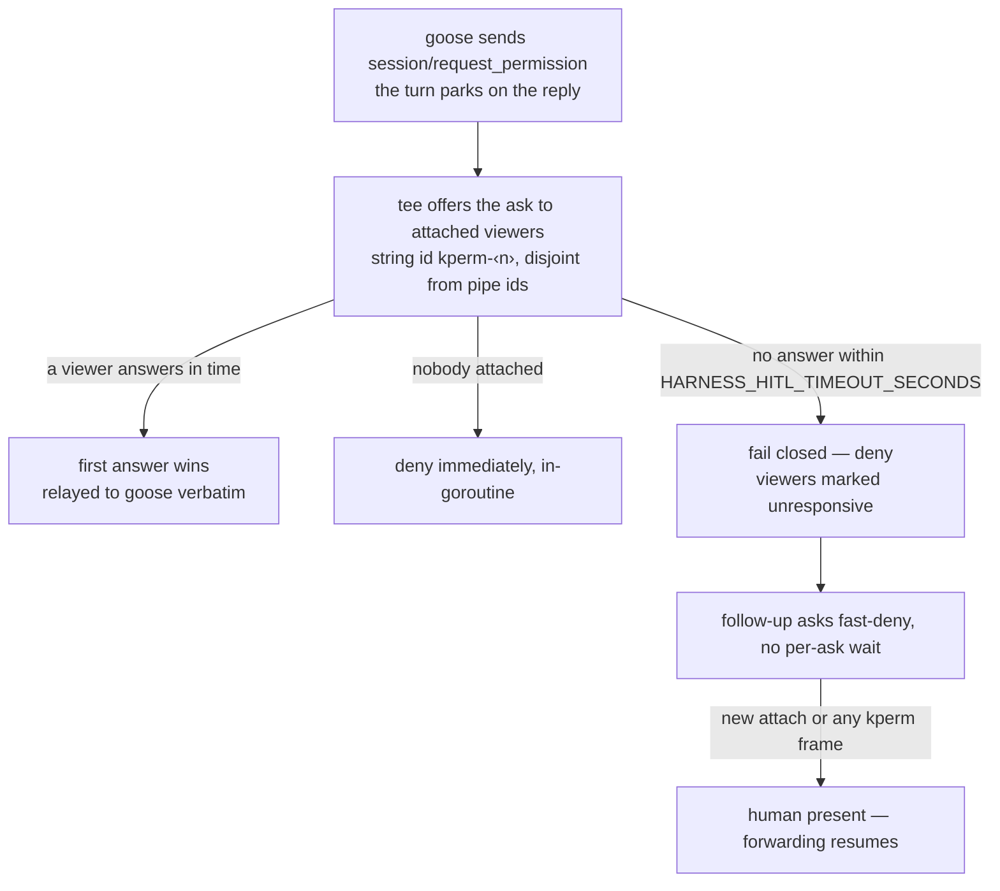

# Human-in-the-loop inside the harness

Status: proposal, 2026-07-29. Answers the open task in konveyor/agentic-controller
issues **#56** ("Define SPEC.md structure and approval flow") and **#55**
("Define how interactive input reaches the agent"). Companion to
`live-progress-design.md`, which covers the read-only half.

## There are two kinds of HITL and they need different mechanisms

| | Stage-gate | In-turn |
|---|---|---|
| Example | approve SPEC.md, answer the questionnaire | approve *this* file edit |
| Granularity | stage boundary | mid-turn, per tool call |
| Lifetime | durable, resumable, auditable | ephemeral |
| Answerable by | someone who isn't watching right now | only someone watching |
| **Mechanism** | **harness control flow + `.konveyor/` file contract** | **ACP `session/request_permission`, behind the tee** |

Conflating them is the trap. A stage gate carried over a WebSocket cannot be
answered by a human who stepped away, and cannot be replayed by the eval stage
(#59) six weeks later. An in-turn approval written to git would be absurd.

## What already works, and what is structurally blocked

**Works today, unchanged:** the shipped Tier 0 attach-and-follow. #53's harness
creates exactly one long-lived ACP session per stage (`CreateSession(ctx,
cloneDir, nil)`, one `SendPrompt`), which is the *ideal* case — no session churn
to chase. A viewer lists, loads, and follows it. Read-only by construction.

**Blocked, and why (all verified against pr-53 + goose v1.39.0):**

1. **goose's permission asks can't reach a browser.** `session/request_permission`
   is agent→client on the connection owning the turn — the harness's. A browser
   lands on a different `GooseAcpAgent` (no cross-connection fan-out). Topology,
   not a missing feature.
2. **The harness can't even receive an agent→client request.** `SendPrompt`
   handles only `IsNotification()` (`ID == nil && Method != ""`) and its own
   id-matched response. An inbound request has *both* an id and a method, so it
   matches neither and is **silently discarded** while goose blocks forever —
   there is no timeout on that path. Dormant only because the image ships
   `GOOSE_MODE=auto` (harness-goose/Dockerfile:23) and `mcpServers` is nil.
   *This is a live defect independent of HITL.*
3. **No durable approval is possible in-process.** The harness has no k8s client,
   `git.Clone` does `os.RemoveAll(destDir)`, and pods are `restartPolicy:
   OnFailure`. The only state surviving a restart is what was pushed.

## The stage gate

Split the stage's single blocking prompt in two. The gap between prompts is the
only moment goose will accept an outside prompt anyway (it rejects concurrent
ones), so it is where a human fits.

```
prompt 1  →  "write SPEC.md, do not write PLAN.md, do not modify sources, stop"
gate      →  harness writes request.json, commits+pushes, polls for answer.json
prompt 2  →  "here is the decision; re-read SPEC.md and the answer from disk"
```

Prompt 2 re-grounds **from disk**, never from conversation history — that is what
makes it survive a pod restart and any goose session-file divergence.

### File contract

`.konveyor/decisions/<stage>.<kind>.<seq>.request.json` — **harness is the only
writer**: `{schemaVersion, id, stage, kind, mode, artifact, artifactSha256,
prompt, options[], default, defaultRationale, openedAt, deadline, round}`.

`.konveyor/decisions/<stage>.<kind>.<seq>.answer.json` — written by whoever
approves: `{schemaVersion, id, value, comment, answers{}, source, answeredBy,
answeredAt}` with `source ∈ human | llm | policy-default | expired-default`.

Two rules that are load-bearing:

- **Ids are derived, never random** (`plan.spec_approval.1`). A restarted run
  regenerates the same id and finds its own answer. Random ids accumulate an
  unanswerable request per restart.
- **`.json`, never `.jsonl`.** pr-53's `ShouldStageNewFile` stages a fixed
  extension set that excludes `.jsonl` — such a file would be written, never
  staged, never pushed, and vanish on restart with no error anywhere.

### Harness change at the hot spot is three lines

```go
if cfg.HITLGate != "" {
    promptErr = runGatedStage(ctx, session, sessionID, prompt, cfg)
} else {
    _, promptErr = session.SendPrompt(ctx, sessionID,
        []acp.ContentBlock{{Type: "text", Text: prompt}}, cfg.MaxTurns)
}
```

The `else` branch is pr-53's `main.go:148` character-for-character — the
non-regression argument is one hunk a reviewer can read.

### Mode is #55/#56's mode, not a new concept

`interactive` = the gate opens and waits. `non-interactive` = the same machinery
runs and the skill self-answers with `source: "llm"` plus reasoning — verbatim
what #56 already specifies and exactly the pair #59 scores. A stage with **no
gate declared** is not a third mode; it's today's behavior.

### When the hold expires: exit 0, not fail

The harness writes `.konveyor/result.json` with `status: "awaiting_input"`,
final-commits, copies result.json (≤4 KiB) to `/dev/termination-log`, and
**exits 0**. Under `OnFailure`, a non-zero exit for "waiting on a human" is an
infinite loop that re-clones, restarts goose, and re-burns a full LLM stage
forever with nobody watching the bill.

`/dev/termination-log` is independently the missing wire for **#43** — the
controller cannot read a file out of a completed pod, and the kubelet already
surfaces the termination message in `pod.status`. Worth selling as closing #43
rather than as HITL.

So: **hold-open is the fast path for a human already watching; exit-with-
awaiting-input is the general path for one who isn't.** Same request, same
answer, same skill contract — two delivery timings, one mechanism.

### Three write paths, identical bytes

1. **Demo-grade, today, zero new code:** a reviewer attaches via Tier 0 during
   the gate window, says "approved, but drop step 7", and the agent writes
   answer.json. *Label this demo-grade — an LLM typing a decision record is the
   weak link.*
2. **Production-grade, after the tee:** a deterministic `POST /gate/decision` on
   the harness's own :4000 listener, no LLM in the loop.
3. **Pod-less:** the answer arrives via ConfigMap projected into the *resume*
   AgentRun (specs are CEL-immutable), copied into the workspace exactly like
   the existing `fetchAndWriteAnalysis`.

Falsifiable claim worth stating upstream: if the file format has to change when
(2) lands, the design failed.

## In-turn HITL — designed now, built third

Needs the tee from `live-progress-design.md` first. Then: enable per-stage via
`session/set_mode` (pr-53 already parses `SessionNewResult.Modes` and discards
it) rather than process-scope `GOOSE_MODE`; relay asks with harness-allocated
**string** ids (`kperm-*`) disjoint from the proxy's verbatim numeric ids;
enrich with a computed diff (goose emits `ToolCallLocation` but never
`ToolCallContent::Diff`, and approving an edit you can't see is theater);
resolve immediately in-goroutine when nobody is attached.

**Redirection — SHIPPED 2026-08-04 (in konveyor #96), and it is not a
permission dialog.** The stronger form of in-turn HITL turned out to be
steering, not approving: goose ships `_goose/unstable/session/steer`
(`{sessionId, expectedRunId, prompt}` → `{runId, messageId}`), which queues a
real user message into the **active** turn. Source-verified semantics
(aaif-goose v1.39.0, `agents/agent.rs`): pending steers drain at the top of
each loop iteration after the first model response; a steer that lands while
the model is trying to finish **un-exits the turn** (`exit_chat = false`); the
pickup streams back as `user_message_chunk` with `_meta.goose.steer` and the
steer's `messageId`; undrained steers are discarded when the run clears. The
active run id needed for `expectedRunId` is broadcast on the stream as
`session_info_update` `_meta.goose.activeRunId` at run start (null at end).

Because goose scopes `active_prompt_runs` to the per-connection agent, a steer
sent down a viewer's own pipe answers "no active run to steer" — so the tee
intercepts viewer frames naming the run session and relays them on the
harness's run connection, preserving the viewer's request id: steer relays
as a call, `session/cancel` relays as a notification (the harness then exits
**failed** on a cancelled stop reason — a human abort is not a success), and a
viewer `session/prompt` while the run is active is rejected with goose's own
"use steer" guidance (two connections prompting one session interleave its
history). `HARNESS_HITL_STEER=off` keeps the stream watch-only. Proven live
(`TestSteerRedirectsLiveRun`, goose 1.39 + Bedrock): the steered agent skipped
its remaining planned tool calls and said so in its final answer.

**Timeout policy — REVISED 2026-08-03 (implemented in feat/harness-acp-tee).**
This doc originally said: on timeout answer `allow_once`, never `cancelled`,
because goose reads a decline as refusal and the agent retries, burning
MaxTurns (which counts `tool_call` notifications). Ian rejected that on
review: an ask that self-approves on a timer is no ask at all — walking away
mid-approval must not approve the action nobody looked at. The shipped
policy: **every unanswered path fails closed** (deny via `reject_once`,
`cancelled` as last resort). The MaxTurns-burn concern is handled by an
*unresponsive-viewer gate* instead: the first timeout marks viewers
unresponsive and subsequent asks resolve instantly like the no-viewer path
(one slow deny, then fast denies); a fresh attach or any kperm frame from a
viewer — even a late or error answer — marks a human present and resumes
forwarding. Net: at most one timeout window is ever burned per absence.

The full ask lifecycle as shipped:



## Sequencing

0. **Comment on #56, cross-ref #55** — this design, as the answer to their open
   tasks. Converts an unsolicited PR into a requested deliverable.
1. **`harness ACP client: don't drop inbound requests`** (~120 LOC + tests,
   post-#53 main, no HITL vocabulary): third select branch for agent→client
   requests; `PromptResult.Turns` so a gated stage shares one MaxTurns budget;
   non-blocking `WSClient.Drain()`; a mutex around commit/push shared with the
   watcher (go-git `Worktree` has no internal locking, and the gate adds a
   second caller). Defensible purely on its own merits.
2. The gate itself (`internal/gate` + config + the three-line branch), with
   non-interactive wired into CI E2E.
3. `result.json` + exit code + termination-message — sold as closing #43.
4. Skills for #56, then #55.
5. The tee, which by then has a concrete consumer.

Nothing goes on savitharaghunathan's branch.

## Open questions for maintainers (theirs to answer, not ours to assume)

- **#56: SPEC.md vs PLAN.md.** pr-53's `skills/plan/SKILL.md` writes PLAN.md;
  #56 says Phase 1 produces SPEC.md. Proposal: SPEC.md = human-facing approval
  artifact, PLAN.md = machine-facing input to execute. **Nothing else can be
  written until this is settled — ask first.**
- Does `decisions/` belong inside the #43 `.konveyor/` contract? (Additive
  either way; the owner of #43 should place it.)
- Is `/dev/termination-log` the sanctioned way for the controller to read
  result.json from a completed pod? Better still — can Agent Sandbox surface it
  in status so the controller needs no pod RBAC?
- Does the workload controller *park* on `awaiting_input` rather than advance?
  **Until answered, "stop" must be unreachable by default** — a stage that
  Succeeds while genuinely waiting is a silent false approval, the worst
  failure available here.
- **May an outside ACP connection prompt the run's session at all?** The gate
  depends on it. A reviewer's turn runs in the same working dir with the same
  tools, and the watcher will commit and push whatever it writes under the
  harness's git identity. Probably its own issue. *Partially settled by #96's
  shipped guard: while the run is active a viewer prompt is rejected and steer
  is the sanctioned channel; the post-run window and authz remain open.*
- Authorization: the pod cannot authenticate anyone; first-click-wins is not an
  authz model. Belongs at the Hub — name it out of scope explicitly.
- issue-22 R2: pod-side :4000 ownership re-opens the fan-out placement settled
  with the Hub maintainer on 2026-07-27. Arguably a gift (R2 shrinks to a dumb
  pipe), but it's their call, and if the shim enforces single-writer per run the
  rule may need to become "one prompter, many approvers".

## Experiment owed before the gate PR

**E1:** does a viewer's own turn during the gate window persist back into the
same goose session file such that the harness's prompt 2 and a reloading browser
both see it? Two `GooseAcpAgent` instances may both persist, last writer wins.
Correctness is protected (prompt 2 re-reads from disk) but the transcript may be
lossy. No capture against real goose exists anywhere in this project yet.

## Honest framing for the demo

This gate approves an *artifact at a boundary*. It does not approve the agent's
individual actions. "The human is in control of what the agent does" would be
false; "the human controls whether the plan proceeds, and can change it in
words" is true — and is exactly the ground sraghunathan's narrowing stakes out.
