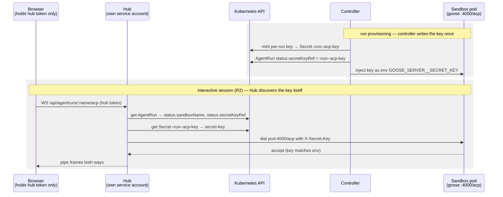

# Canonical contract comment on konveyor/agentic-controller#22

Mirror of the consolidated comment (edited in place 2026-07-21; the
2026-07-27 placement decision folded in and the whole comment rewritten
for concision the same day):

https://github.com/konveyor/agentic-controller/issues/22#issuecomment-4905804098


The thread now holds this one canonical comment plus three pointer

stubs; originals of all pre-consolidation comments are in GitHub edit

history. Supersedes `issue-22-contract-proposal.md`,

`issue-22-followup.md`, `issue-22-followup-2.md`, and

`issue-22-placement-decision.md` as the record of what is on the

thread. Standing rule unchanged: future upstream edits are a human

decision — update this mirror when the comment changes.

---

> **Consolidated 2026-07-21 · placement decided 2026-07-27.** This comment is the single current reference for the proposed client contract; my three follow-up comments below are stubs (originals in edit history). Everything here is backed by running code in [ibolton336/agentcontroller-client](https://github.com/ibolton336/agentcontroller-client).

Issue 3.1 depends on the Stream 2 API contract, so here's a concrete proposal — not from a whiteboard, but from a running system.

## What exists today

Prototyped against the real controller (PR #4) on minikube (Agent Sandbox v0.5.0); verified with the mock harness and a real goose+Bedrock base:

- create AgentRun → `Running` → resolve pod + ACP secret → ACP session: streaming updates, HITL permission round-trips with diff preview, cancel
- three-stage AgentPlaybook flow (assess → remediate → validate) end-to-end in batch mode behind #36
- isomorphic client core (`@konveyor/agentic-client`: contract types + `AcpSession` over plain WebSocket, no node builtins); two transports: direct-k8s (IDE/node) and proxy (browser), the latter driven today against a local `hub-shim` stand-in

Details: [ADR 0004 — verified client contract and layered transports](https://github.com/ibolton336/agentcontroller-client/blob/main/docs/adr/0004-client-contract-and-transports.md), [ADR 0005 — platform-resolved params](https://github.com/ibolton336/agentcontroller-client/blob/main/docs/adr/0005-platform-resolved-params.md).

## Agent Runs API v1 — the proposed surface

Host-neutral by design — a client swaps only base URL + auth across placements. It lands in the Hub (see **Placement decided**), which mounts it under its own route namespace.

| Method | Route | Behavior |
|--------|-------|----------|
| GET | `/healthz` | 200 `ok` |
| GET | `/api/applications` | 200 `Application[]` — platform application inventory |
| GET | `/api/agents[/:name]` | 200 `Agent[]` \| `Agent` (full CRs) \| 404; the list is filtered to `konveyor.io/managed=true` (get-by-name never filtered) |
| GET | `/api/llmproviders[/:name]` | 200, full-CR shape, read-only |
| GET | `/api/skillcards[/:name]` | 200, full-CR shape, read-only |
| GET | `/api/skillcollections[/:name]` | 200, full-CR shape, read-only |
| GET | `/api/agentruns[/:name]` | 200 `AgentRun[]` \| `AgentRun` \| 404 |
| POST | `/api/agentruns` | 201 — body `{agentRef, params?, instructions?, applicationRef?}`; `applicationRef` resolves the agent's declared param/credential sources (below) |
| DELETE | `/api/agentruns/:name` | 204 |
| WS | `/api/agentruns/:name/acp` | proxy to the sandbox pod's `:4000/acp` — resolve the pod (`status.sandboxName`), read the key (`status.secretKeyRef` → `secret-key`), inject `X-Secret-Key`, pipe frames |
| GET | `/api/agentplaybooks[/:name]` | 200, managed-filter like agents |
| GET/POST | `/api/agentplaybookruns`; GET/DELETE `/:name` | POST body `{playbookRef, params?, applicationRef?}` — same resolution as agentruns, values forwarded to every stage |

## Contract facts the client layer depends on

Verified against the live controller (rationale in ADR 0004):

- pod name == `status.sandboxName` == run name; resolve by name, never by label (pods currently carry no `konveyor.io/agentrun` label — patch proposed separately)
- ACP key Secret `<sandboxName>-acp-key`, data key `secret-key`, via `status.secretKeyRef.name`
- ACP server: pod `:4000`, path `/acp`, `X-Secret-Key` auth; `/healthz` unauthenticated
- the auto-created Service is headless with no ports — dial the pod (or `<sandboxName>.<ns>.svc:4000` in-cluster)
- AgentRun spec is immutable (whole-spec CEL) ⇒ every edit/retry UI affordance is delete + recreate
- **Permission diff preview needs no protocol extension.** ACP already standardizes it: `session/request_permission`'s `toolCall` is a `ToolCallUpdate` whose `content[]` accepts `{type: "diff", path, oldText, newText}` (`oldText: null` = new file). Agents just populate it; implemented end to end (mock harness → WS proxy → browser render above Allow/Reject).

## Placement decided

Outcome of a 2026-07-27 design sync with the Hub maintainer: **Hub-native endpoints for both R1 (REST CRUD) and R2 (the interactive WS channel).**

1. **The task system is not the launch vehicle.** A Task is the run of an addon; carrying agent runs in it would force the task engine to become a second agent-run controller. The Hub instead exposes handlers under a common route namespace (e.g. `/agent/…`) with standard scopes, fire-and-forget: POST creates the CR, no reconciliation, the UI polls. Value-add: RBAC (architect/migrator scoping) + create-time injection.
2. **The CR stays platform-neutral.** No Konveyor spec fields (`appID` is out); generic env-var extensibility carries `HUB_URL`, the application ID, and a token materialized as a Secret. Anything in-cluster can still create the CR outside a Konveyor install.
3. **The harness is Konveyor-aware — the addon-adapter pattern.** Given hub URL + token + app ID, it fetches the application's details via the published hub Go client, clones the repo, **withholds the credentials from the agent** (the agent can't push), builds the prompt from skills, and starts the ACP server. As with addons, the host doesn't anticipate what the workload needs — the workload pulls what it wants from the inventory.
4. **The interactive channel (R2) is a separate Hub deliverable** — its own issue, so the launch path doesn't depend on it. The split is clean because playbook stage runs are batch and exercise R1/R3–R5, never R2; interactive single-agent runs are today's only R2 consumer.

### Responsibilities

| # | Responsibility | Where it lands |
|---|----------------|----------------|
| R1 | Authenticated REST CRUD over the CRs (agents, runs, playbooks, playbook-runs; read-only providers/skillcards/skillcollections) | Hub — thin k8s passthrough + authz + the managed-label list filter; no domain logic |
| R2 | Long-lived bidirectional WS proxy to the run pod (resolve, inject key, pipe frames) | Hub, separate deliverable — the one thing browsers can't do (no custom upgrade headers, no route to the pod) and no existing Hub mechanism provides; makes the host stateful; single-writer required (below) |
| R3 | Application inventory read (`GET /api/applications`) | Hub, for the UI's application picker (the shim reads a real Hub for this today); the harness also reads inventory directly |
| R4 | Identity → Secret materialization | Hub materializes only the token Secret; identity retrieval lives in the harness via the Hub API (stubbed in the shim — only the vault owner can supply identities for real) |
| R5 | Param/credential resolution at run construction | Harness, for the Hub path — the Hub passes only `{HUB_URL, app ID, token}`; create-time resolution stays for other callers (below) |

### Credentials

Three domains, with a wall *inside the pod*: browser hub-token → Hub (existing); harness hub-token (scoped, Secret-mounted) → Hub API; per-run ACP key → agent server. The harness sees the git credentials; the agent never does.

**Key discovery needs nothing new.** The question this answers: for R2 the Hub must present the per-run ACP key when it dials `pod:4000/acp` — so how does it learn each run's key? No handshake, registration endpoint, or harness phone-home is needed, because the controller already puts the key where the Hub can reach it:

1. On AgentRun creation the controller mints a random key and writes it to Secret `<run>-acp-key` (data key `secret-key`).
2. It records the Secret's name in `status.secretKeyRef` — a pointer discoverable by anyone who can read the CR.
3. It injects the same key into the sandbox pod's env (`GOOSE_SERVER__SECRET_KEY`), which is what goose checks incoming connections against.

Discovery for the Hub is therefore two Kubernetes reads with its own service account: get the AgentRun, follow `status.secretKeyRef` to the Secret, decode `secret-key`. The only prerequisite is RBAC — `get` on agentruns and secrets in the runs' namespace. Distribution is fan-out from Kubernetes itself: the controller writes the key once, and the pod (env injection) and the Hub (API read) each pull it independently. The harness is purely a *consumer* — the key never transits any application-level channel, so there is no code path where the harness could leak or mishandle it. The genuinely new piece for R2 is not discovery but the **credential swap at the proxy boundary**: hub token in, `X-Secret-Key` out.



Two invariants fall out of the picture: the key never reaches the browser (the hub token stays the browser's only credential), and no arrow carrying the key ever points *out of* the pod.

- **Reusing the hub API token as the ACP `X-Secret-Key` is rejected**: it puts a Hub-scoped credential into the pod env and into `?token=` URLs (goose accepts the key as a query param for browser clients; key-in-URL leaks into access logs), for no gain over the narrower per-run key the controller already mints.

### R2 requirement: single-writer

Verified against goose v1.39.0 source (the ACP server we ship): every WebSocket connection gets a **private agent instance** — its own event stream and active-run guard; sessions share only the SQLite store. So: no live fan-out (a second client on the same session sees only `session/load` replay), and the one-prompt-at-a-time guard doesn't cross connections — two clients can interleave writes on one session. The platform proxy must enforce single-writer per run (or later fan one upstream out to N viewers); goosed will do neither.

## Param-source annotations

Superseded for the Hub path by harness-pulls; still the mechanism for callers that resolve values at create time. The gap it closes: an Agent declares typed params, but nothing declares that `repository` **is** the selected application's repo URL.

```yaml
metadata:
  labels:
    konveyor.io/managed: "true"          # Konveyor UIs list only these
  annotations:
    konveyor.io/param-sources: |
      {"repository": "konveyor.io/application-repository-url",
       "branch": "konveyor.io/application-repository-branch"}
    konveyor.io/credential-sources: |
      {"git": "konveyor.io/application-identity"}
```

Three deliberate choices (reasoning in ADR 0005): **source ids are free-form namespaced strings, not a CRD enum** — an enum bakes Hub's vocabulary into a CRD whose controller ignores the field, and new values become schema upgrades that fail *closed* (`storageClassName` precedent); **fail open** — an unrecognized source id MUST be treated as caller-supplied and the field rendered; **credentials use the same mechanism**, resolving to a Secret mounted via `spec.envFrom`.

At create, caller-supplied values win; a required param with a *recognized* source the application can't supply is a 400, never silently empty. Verified: `POST {agentRef, applicationRef}` with **no params** yields a Running pod with resolved repo URL/branch and the identity Secret mounted — the create form for a fully sourced agent collapses to application picker + instructions. Carrier is an annotation today; graduation path is an optional `source` field on `AgentParam`.

## Open question (Stream 2)

**Source-vocabulary governance** is the sole remaining open question: does the vocabulary live in a well-known-values doc, and does `source` graduate to a CRD field or stay annotation-based until Hub's application model settles? Urgency dropped: the primary host no longer consumes the annotations.

(Resource coverage was open earlier — answered: read-only is sufficient for SkillCard/SkillCollection/LLMProvider in the UI phase, since the UI only reads them.)

## Next steps

- Enhancement update reflecting the above (in progress)
- Hub tracking issue: R1 routes + scopes + create-time env/token injection
- Separate linked Hub issue for R2: dynamic per-run upstream, credential swap at the proxy boundary, a WS-friendly auth carrier for the hub token (browsers can't set `Authorization` on upgrade), and single-writer enforcement

If anything in the routes or the R1–R5 split looks wrong, flag it here — the Hub tracking issues will be cut directly from this comment.
