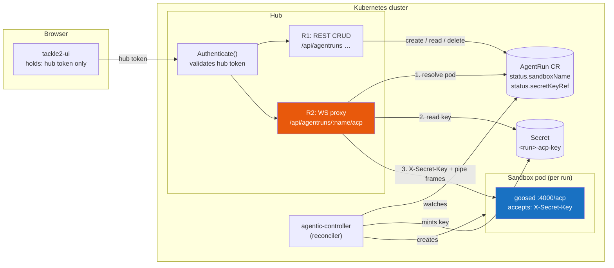
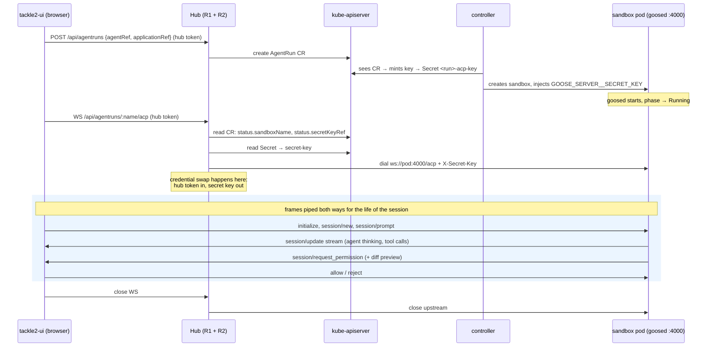
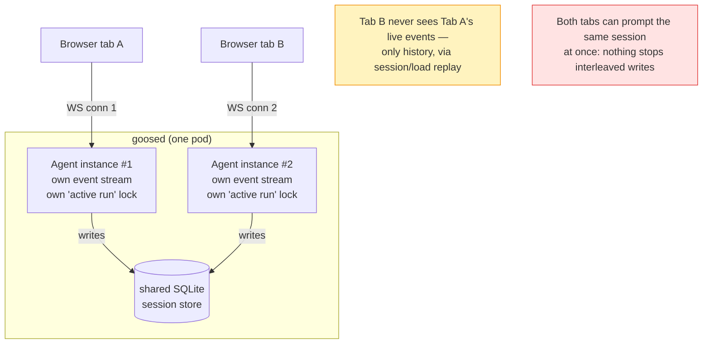

# The agent chat pipeline, explained — who talks to whom, and why the Hub sits in the middle

Plain-English companion to `issue-22-contract.md` (the formal proposal) and
`issue-22-concurrency-findings.md` (the source-verified research). Read this
one first.

## The cast

- **tackle2-ui** — the browser app. Holds exactly one credential: the hub
  token it already uses for every other Hub call.
- **Hub** — the Konveyor server. Validates hub tokens, has a Kubernetes
  service account, already reverse-proxies to in-cluster services
  (`ServiceHandler.Forward`).
- **agentic-controller** — stateless reconciler. Creates the sandbox, mints
  the ACP secret key, then gets out of the way. It never sits on the chat
  path.
- **Sandbox pod** — one per AgentRun. Runs `goose serve` on port 4000: the
  agent itself, speaking ACP (Agent Client Protocol) over WebSocket. Auth is
  a per-run secret key. Lives only as long as the run.

## The big picture

Two credential domains, one bridge. The browser lives entirely in
**hub-token land**. The pod lives entirely in **secret-key land** — goosed
has never heard of hub tokens. R2 (highlighted) is the bridge: it swaps one
credential for the other at the proxy boundary, and it is the only piece of
this diagram that doesn't already exist in some form.

## Why the browser can't just go straight to the pod

Three independent blockers — any one is fatal on its own:

| # | Blocker | Detail |
|---|---------|--------|
| 1 | **No route** | Pod IPs are cluster-internal. The run's auto-created Service is headless with **no ports** — nothing to point an Ingress at. A browser cannot open a TCP connection to `pod:4000`, full stop. |
| 2 | **No key** | The ACP key lives in a k8s Secret. Reading it requires Kubernetes API credentials — which you will never ship to a browser tab. |
| 3 | **No multi-client semantics** | Even with 1+2 solved, goosed gives every WebSocket connection its own private agent instance: no shared live stream, no cross-connection "one prompt at a time" lock. Two tabs could corrupt one session. Someone platform-side has to mediate. |

(The often-repeated fourth reason — "browsers can't send the
`X-Secret-Key` header on a WebSocket" — is true but *moot*: goose also
accepts `?token=` in the URL precisely for browsers. Auth was never the
real problem. See the findings doc, §2.)

## The interactive session, step by step

The controller appears only at the top — it sets the stage and leaves.
Everything live flows browser ↔ Hub ↔ pod.

## R1–R5: the five things the host must provide

"Host" = whichever component exposes this API surface. The issue-22
proposal keeps that deliberately open, but every candidate must supply:

| # | Obligation | One-liner | Hub already has the shape? |
|---|-----------|-----------|----------------------------|
| R1 | REST CRUD over the CRs | List/create/delete agents, runs, playbooks; read-only providers/skills | ✅ plain authenticated k8s passthrough |
| R2 | **WS proxy to the run pod** | Resolve pod → read key → inject → pipe frames | ⚠️ closest thing is `ServiceHandler.Forward` — static routes, no credential swap |
| R3 | Application inventory read | `GET /api/applications` | ✅ it's Hub's own data |
| R4 | Identity → Secret materialization | App's platform credential becomes a mounted Secret before pod start | ✅ Hub owns the vault |
| R5 | Param/credential resolution | Fill `repository`, `branch`, git creds from the selected application (per the agent's own annotations) | ✅ same shape as the analysis wizard/addon path |

R2 is the odd one out — the only long-lived, stateful, dial-into-a-pod
obligation — which is why the whole "do we need a separate service?"
debate orbits it. The answer landed: **no separate service required.** R2
is one WebSocket route, implementable as a modest extension of Hub's
existing forward pattern (dynamic per-run target + credential swap + a
WS-friendly way to present the hub token).

## The concurrency footnote (why the middleman helps even beyond plumbing)

What goose v1.39.0 actually does when several clients connect:

Each WebSocket gets a **private** agent instance; sessions are shared only
through the SQLite file underneath. So "multiple clients" works for
*attach-and-replay*, but not live co-viewing, and there is no cross-client
guard against two simultaneous prompts on one session. The platform-owned
proxy is the natural place to enforce single-writer (today) or fan one
upstream out to N viewers (later). goosed won't do either for you.

## Where things stand

- The whole surface (routes, payloads, behaviors) is proposed on
  [konveyor/agentic-controller#22](https://github.com/konveyor/agentic-controller/issues/22#issuecomment-4905804098),
  backed by running code in this repo — the local `hub-shim` implements it
  end-to-end today, with the browser UI driving real runs through it.
- Open question on the thread is **placement** (which component hosts
  R1/R2), not feasibility.
- Deep dives: `issue-22-contract.md` (the contract), ADR 0004 (verified
  facts + transports), ADR 0005 (param resolution),
  `issue-22-concurrency-findings.md` (goose source research behind §3 of
  this doc).
