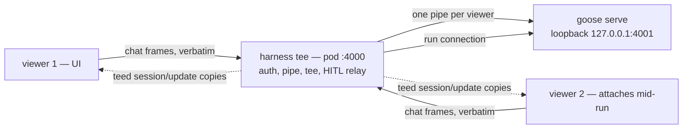
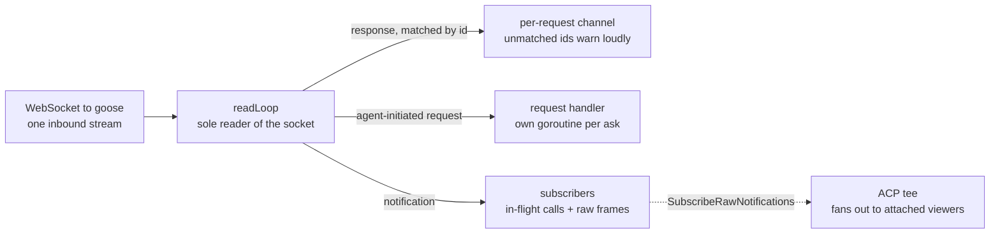

# Live run progress over ACP — root cause and design

Status: proposal 2026-07-29; Tier 1 tee + steering SHIPPED 2026-08-04 as
konveyor #96 (demux #95 and string-id fix #94 merged earlier). Companion to
`harness-mental-model.md` and the issue-22 contract docs. Everything cited
below was verified against source (goose fork `aaif-goose/goose` at `v1.39.0`
— the tag `harness-goose/Dockerfile` pins — plus this repo), not inferred.

## The problem, restated precisely

The UI cannot see a run while it executes. Users wait for per-item commits (or
the end of the run) to learn what the agent did. The instinct is "the harness
should send more progress notifications over the ACP WebSocket" — but that is
not the actual defect, and notifications alone cannot fix it.

## Root cause: topology, not vocabulary

Three verified facts compose into the real bug:

1. **`session/update` is agent→client only.** The ACP schema marks
   `SessionNotification` with `x-side: client` (SDK `schema.json`,
   `$defs.SessionNotification`). The harness sits on the **client** side of the
   pod's only ACP link. There is no spec-legal way for the harness, as a
   client, to emit progress notifications on that link. Adding "more messages"
   to the current topology is a dead end by construction.

2. **goose gives every WebSocket connection a private, empty agent.** On each
   WS upgrade, `handle_ws_upgrade` calls `registry.create_connection()`, which
   calls `self.server.create_agent().await` — a **fresh `GooseAcpAgent` per
   connection** (`crates/goose/src/acp/transport/websocket.rs:14-49`,
   `transport/connection.rs:101-139`, `server_factory.rs:56-96`). Outbound
   streams (`connection_stream`, `session_streams`, `all_outbound`) are fields
   of the per-connection struct. **There is no cross-connection fan-out.**
   When the browser dials `:4000/acp` it lands on a different agent instance
   than the harness's; the run's stream is structurally unobservable.

3. **The UI's chat session is therefore a parallel universe.** ChatPanel does
   `session/new` on connect (`ui/src/components/ChatPanel.tsx:286`) — a new
   session on a new agent. Today's "chat with the run" has never shown the run.

So: the harness *receives* a rich live stream from goose and throws it away
(`internal/acp/session.go:227-242` logs tool title/status, drops the rest),
while the UI connects to an agent that has nothing to show.

## What the stream already carries (and doesn't)

goose's ACP server already emits **file locations** on tool calls: for
`text_editor` requests it extracts `path` + `line` into `ToolCallLocation`
(`crates/goose/src/acp/server.rs:459-553` — `str_replace`, `insert`, `write`,
`view` all covered; MCP tools can supply `_meta.tool_locations`). This is the
protocol's "follow-along" feature: **which file, which line, right now** is
already on the wire the harness reads.

Not carried: `ToolCallContent::Diff` is never constructed (no `Diff` usage in
`acp/server.rs`), and `ToolKind` is always `default()` (`server.rs:1837`). So
live *diffs* need harness-side computation; live *file activity* does not.

Two client-side accidents work in our favor and should be codified, not
depended on silently:

- `AcpSession.handleNotification` never filters on `params.sessionId`
  (`packages/agentic-client/src/acp/index.ts:409-426`) — every `session/update`
  on the socket reaches the reducer.
- ChatPanel's reducer ignores unknown `sessionUpdate` kinds (`ChatPanel.tsx:160-162`)
  — `plan` and future kinds are safe, no crash.

## The design: invert the topology, then tee

**The harness becomes the ACP endpoint on `:4000`; goose moves to loopback.**

```
before:  browser ──(shim pipe)──▶ pod:4000 = goose  ◀── harness (client)
after:   browser ──(shim pipe)──▶ pod:4000 = harness ──▶ 127.0.0.1:4001 = goose
```

Nothing outside the pod changes: `ACP_PORT = 4000` is hardcoded client-side
(`packages/agentrun-client/src/kube.ts:42`), the shim pipes frames opaquely
(`packages/hub-shim/src/server.ts:789-916`), auth stays `X-Secret-Key` /
`?token=`. This is also consistent with ADR 0002's own future story — the
harness bridge in front of non-ACP runtimes — extended, not superseded.

**Tier 1 mechanism — a dumb pipe with a tee (~350 LOC, no protocol invention):**

- Harness listens on `0.0.0.0:4000/acp`. For each client socket it opens **its
  own upstream socket** to goose on `127.0.0.1:4001` and pipes frames
  **verbatim, byte-for-byte, 1:1** — exactly what the hub-shim already proves
  at `server.ts:815-873`, moved inside the pod. No id remapping, no capability
  emulation, no observer sessions, no reimplementation of the ACP agent role.
  Every present and future goose capability passes through untouched;
  interactive chat keeps working exactly as today.
- The only addition: **tee the harness's own run-connection inbound
  `session/update` frames into every attached client socket, unmodified,**
  keeping the run's real sessionId. Teed frames are notifications (no `id`),
  so they cannot collide with proxied request/response pairs.
- Result: an **unmodified ChatPanel renders the run's live activity** —
  message chunks, thoughts, tool calls with file locations — because of the
  two client behaviors above. That is the acceptance test.

As implemented in `feat/harness-acp-tee` (konveyor PRs #94/#95/#96), the three
kinds of traffic through the junction — only the dotted one is new:



Operational discipline (from the adversarial review — these are conditions,
not niceties):

- Ship **default-ON** with a kill-switch env var (a default-OFF flag means the
  one E2E path never exercises it and reviewers are merging dead code).
- `recover()` in every per-connection goroutine; a panic is a warning, never a
  run failure. Invariant test: garbage frames from a fake viewer, all viewers
  disconnecting mid-run, and a dead listener must leave commit+push unaffected.
- Bounded per-subscriber buffers; on overflow drop that subscriber (it can
  reconnect), never block the run path.
- Serve `/healthz` unauthenticated (ADR 0004 contract, ~5 LOC).
- Decide the sessionId story explicitly in the ADR rather than relying on the
  no-filter accident: teed frames carry the run session id; a client that
  wants only its own session filters; document it.

### Prerequisite repair: the harness ACP client cannot multiplex

`WSClient.Call` steals every notification that arrives while waiting and
silently drops responses whose id doesn't match (`internal/acp/wsclient.go:103-120`);
between prompts **nothing** drains `recv` (256-cap channel, drops when full,
`wsclient.go:72-76`). Notifications received during `initialize`/`session/new`
are returned as a slice, scanned once for a sessionId, and discarded
(`session.go:110-120`). A tee bolted onto `SendPrompt`'s loop would miss all
of that.

The real first Go change is a **single demux goroutine that owns `recv`**:
routes responses to per-request channels keyed by id, fans notifications out
unconditionally (the tee is one subscriber), stamps sequence/timestamp at read
time, errors loudly on unmatched ids. ~250 LOC with a `-race` test running a
prompt and a concurrent call. Everything else sits on top of this.

Shipped as konveyor PR #95 — the demux routes each inbound frame by kind:



### ⚠ Scope caveat: the local tree is the pre-#53 harness

`agentic-controller/harness/` here is the **old** harness
(`docs/harness-mental-model.md` marks it obsolete; the shipping image runs the
PR #53 rewrite, +3461/−8656 across 106 files, which deletes
`execute/plan/verify/fixloop/metrics/handoff` and `acp_runner.go`). All
file:line references to harness internals above locate the *concepts*; the
implementation must be re-derived against post-#53 main (`gh pr checkout 53`
into a scratch worktree first — experiment E6). Do not target #53's branch
itself; it is a maintainer's open PR.

## Tier 0 — client-only, ships this week, no upstream ask

**Status: BUILT and E2E-verified 2026-07-29** (this repo: `packages/agentic-client`
+ `ui/src/components/ChatPanel.tsx` + `harness-mock`). Verified in-browser on
minikube through the real shim WS pipe: the panel attaches to a pod-side
session it never created, shows a "following run session" state and a files
ticker, and the transcript grows across poll ticks with no interaction.

1. **Attach-to-run via `session/list` + `session/load`.** goose lazily
   activates sessions that exist on disk but were never opened on this
   connection (`acp/server/dispatch.rs:20-24`; `load_session.rs` replays
   history), and advertises `sessionCapabilities.list` (`server.rs:2152-2156`).
   So a fresh browser connection lists sessions, loads the most recently
   active one (during a run: the harness's), and re-loads whenever
   `updatedAt` advances — near-live catch-up, **zero harness changes**.
   Implemented: `AcpSession.listSessions()` + capability detection in
   `agentic-client`, attach-first connect flow + 5s follow-poll in ChatPanel,
   `session/list`/`updatedAt`/`MOCK_SELF_RUN` in harness-mock (which now
   mirrors goose's no-cross-connection-streaming behavior). Granularity of
   mid-turn persistence against real goose = experiment E0, still open.
2. **Render what's already there:** `locations[]` and `{type:"diff"}` blocks
   from `tool_call`/`tool_call_update` now render as per-tool location chips,
   a files-touched ticker, and inline DiffPreviews in the transcript.

## Later tiers (gated, in order)

- **Stage/item ladder as ACP `plan` updates.** The workload's items map
  naturally onto `PlanEntry` pending/in_progress/completed. Two gates:
  (a) reconcile with the agreed `.konveyor/result.json` stage-status contract
  (#43/#54) — durable stage status stays in result.json; the ACP stream
  carries only ephemeral in-flight activity, derived from the same source,
  never a third vocabulary; (b) ACP spec gap: `PlanEntryStatus` has no
  `failed`/`skipped`, so a failed item renders "completed" in conformant
  clients — worth filing upstream on the ACP spec before leaning on it.
- **Pre-commit diffs.** Harness computes worktree diffs (go-git status/diff
  sampled on quiet periods) and emits them as `tool_call_update` with
  `{type:"diff"}` content. Consume #53's fsnotify watcher via a small callback
  hook rather than adding a second scanner. go-git `Worktree` has no internal
  locking — serialize sampler and `CommitAll` behind one repo mutex.
- **Steering — SHIPPED in #96 (E5 answered from source, then proven live).**
  `_goose/unstable/session/steer` takes `{sessionId, expectedRunId, prompt}`
  and returns `{runId, messageId}`; goose queues the message into the active
  turn, drains it at the next loop iteration, streams the pickup as
  `user_message_chunk` with `_meta.goose.steer`, and a steer landing while
  the model wraps up keeps the turn alive. `expectedRunId` comes off the teed
  stream (`session_info_update` `_meta.goose.activeRunId`). goose scopes the
  active run to the connection that started it, so the tee relays viewer
  steer/cancel frames naming the run session onto the run connection
  (viewer request id preserved) and rejects viewer `session/prompt` while
  the run is active, with goose's own use-steer wording. Kill switch
  `HARNESS_HITL_STEER=off`. The "may outsiders touch the run session"
  question is answered as: prompt no (while active), steer yes (gated),
  authz still the Hub's problem.

## Sequencing upstream

1. **E0 first, code later:** capture a real goose 1.39 transcript (two
   concurrent WS clients, `session/list`, `session/load` mid-prompt, 60s of
   frames). It proves the no-fan-out premise *live*, answers Tier 0's
   granularity question, and is the artifact the whole proposal hangs on.
   No such capture exists anywhere in the project today.
2. **Docs before Go:** the issue-22 contract (settled 2026-07-27) assigns
   fan-out to Hub R2. Pod-side fan-out re-opens that placement — arguably a
   gift (R2 shrinks to a dumb pipe with a credential swap), but it is the Hub
   maintainer's call. Update the #22 comment / ADR first; a PR that silently
   contradicts a published contract burns trust.
3. **Then the tee PR** against post-#53 main: demux + listener + tee,
   default-ON, kill switch, fault-injection tests.
4. **Then** ladder / diffs / steering as separate conversations.

## Experiments (each ≤ an afternoon)

| # | Question | Method |
|---|----------|--------|
| E0 | Does a 2nd connection see any live frames? What does `session/load` replay mid-turn? | two `websocat` clients against a run |
| E1 | Does goose ever attach `locations[]` / diff content in our config? | capture transcript during a text_editor-heavy prompt |
| E3 | Does `goose serve` without `--host` bind loopback or 0.0.0.0? | `lsof -nP -iTCP:4001 -sTCP:LISTEN` |
| E4 | Both auth carriers accepted? String vs int `protocolVersion`? | `websocat` matrix |
| E5 | ~~`_goose/unstable/session/steer` request/response shape?~~ **ANSWERED 2026-08-04**: `{sessionId, expectedRunId, prompt[]}` → `{runId, messageId}` (goose-sdk-types `custom_requests.rs`); verified live via `TestSteerRedirectsLiveRun` | ~~send during active prompt~~ source + live probe |
| E6 | What seams exist in the #53 harness tree? | `gh pr checkout 53` scratch worktree, read |
| E7 | go-git `Status()` p95 on coolstore-sized repo? | 20-line benchmark |
