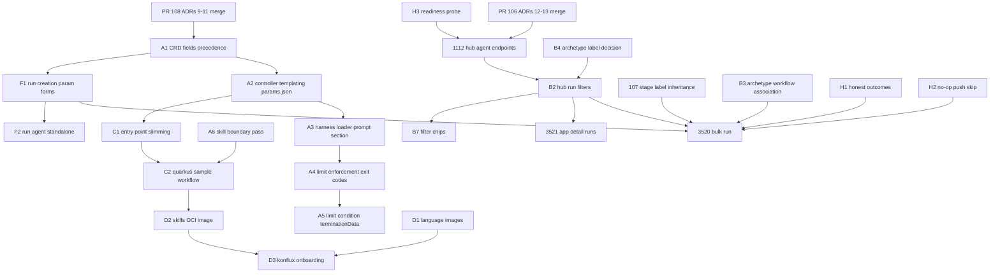

# v0.11.0 dev-preview issue tree

**Status: FILED 2026-08-07.** The map below is live on GitHub; this doc stays
as the design rationale behind the issues.

| Tree ID | Issue | | Tree ID | Issue |
|---|---|---|---|---|
| A1 | [AC #115](https://github.com/konveyor/agentic-controller/issues/115) | | D2 | [AC #126](https://github.com/konveyor/agentic-controller/issues/126) |
| A2 | [AC #116](https://github.com/konveyor/agentic-controller/issues/116) | | D3 | [AC #127](https://github.com/konveyor/agentic-controller/issues/127) |
| A3 | [AC #117](https://github.com/konveyor/agentic-controller/issues/117) | | F3a | [AC #128](https://github.com/konveyor/agentic-controller/issues/128) |
| A4 | [AC #118](https://github.com/konveyor/agentic-controller/issues/118) | | H1 | [AC #129](https://github.com/konveyor/agentic-controller/issues/129) |
| A5 | [AC #119](https://github.com/konveyor/agentic-controller/issues/119) | | H3 | [AC #130](https://github.com/konveyor/agentic-controller/issues/130) · GFI |
| A6 | [AC #120](https://github.com/konveyor/agentic-controller/issues/120) · GFI | | I1 | [AC #131](https://github.com/konveyor/agentic-controller/issues/131) |
| B4 | ~~[AC #121](https://github.com/konveyor/agentic-controller/issues/121)~~ closed 2026-08-18: application-only for the preview, no archetype label (ux-gaps action list) | | B3 | ~~[hub #1115](https://github.com/konveyor/tackle2-hub/issues/1115)~~ closed 2026-08-12: association cut from preview (ux-gaps Area 1) |
| C1 | [AC #122](https://github.com/konveyor/agentic-controller/issues/122) | | E2 | [hub #1116](https://github.com/konveyor/tackle2-hub/issues/1116) |
| C2 | [AC #123](https://github.com/konveyor/agentic-controller/issues/123) | | B7 | [ui #3523](https://github.com/konveyor/tackle2-ui/issues/3523) · GFI |
| C3 | [AC #124](https://github.com/konveyor/agentic-controller/issues/124) · GFI | | F1 | [ui #3524](https://github.com/konveyor/tackle2-ui/issues/3524) |
| D1 | [AC #125](https://github.com/konveyor/agentic-controller/issues/125) · GFI | | F2 | [ui #3525](https://github.com/konveyor/tackle2-ui/issues/3525) |
| | | | F3b | [ui #3526](https://github.com/konveyor/tackle2-ui/issues/3526) |
| | | | F4 | [ui #3527](https://github.com/konveyor/tackle2-ui/issues/3527) |
| | | | G1 | [operator #590](https://github.com/konveyor/operator/issues/590) |

All AC issues are in milestone **v0.11.0** (48 open after filing). Not filed
by design: **H2** shipped straight as fix
[PR #114](https://github.com/konveyor/agentic-controller/pull/114); **B2**
folded into the [hub #1112 acceptance-criteria comment](https://github.com/konveyor/tackle2-hub/issues/1112#issuecomment-5217743396);
**B1** is existing [#107](https://github.com/konveyor/agentic-controller/issues/107)
(now milestoned, fix open as [PR #113](https://github.com/konveyor/agentic-controller/pull/113));
**B5/B6** landed as scope comments on
[ui #3520](https://github.com/konveyor/tackle2-ui/issues/3520#issuecomment-5217933990) /
[ui #3521](https://github.com/konveyor/tackle2-ui/issues/3521#issuecomment-5217934183).

**Sources:** the 2026-08-06 scope call; ADRs 0009–0011
([PR #108](https://github.com/konveyor/agentic-controller/pull/108));
ADRs 0012–0013 ([PR #106](https://github.com/konveyor/agentic-controller/pull/106));
merged ADR 0006 ([#105](https://github.com/konveyor/agentic-controller/pull/105));
the current [v0.11.0 milestone](https://github.com/konveyor/agentic-controller/milestone/21)
(30 open); tackle2-ui tracking issues
[#3504](https://github.com/konveyor/tackle2-ui/issues/3504) /
[#3520](https://github.com/konveyor/tackle2-ui/issues/3520) /
[#3521](https://github.com/konveyor/tackle2-ui/issues/3521) /
[#3522](https://github.com/konveyor/tackle2-ui/issues/3522).

**Repo shorthand:** `AC` = konveyor/agentic-controller · `HUB` =
konveyor/tackle2-hub · `UI` = konveyor/tackle2-ui · `OP` = konveyor/operator.
**GFI** = good first issue candidate. Everything is milestone **v0.11.0**
unless marked otherwise.

---

## 0. Scope fences (agreed on the call — write these into triage labels)

1. **Secrets:** no UI, no Hub-credential integration. CRD-level only — an
   Agent may reference a k8s Secret that is injected as env vars on the run
   pod. Secrets are never rendered into prompts.
2. **HITL:** read-only status for dev preview. Steering (merged in AC #96)
   stays behind a feature flag, default off. Write-to-stream needs a Hub
   authorization story before it is ever exposed.
3. **Prompt-injection controls:** knowingly absent; deliberately parked
   (tracked as a design issue so it stays a decision, not an accident).
4. **Existing CRUD screens** (skills / agents / workflows) ship as-is. No
   polish work before the UX redesign that comes later.
5. **Harness = minimal entry point.** Bookends only. All migration business
   logic lives in sample workflows/agents.

---

## A. Params, substitution, execution controls (ADRs 0009 + 0011) — repo: AC

The call put **all** of this in dev preview. Issues below derive from the
**final round-3 revision (`5af6e99f`)**, which differs from earlier drafts:
`maxTokens` is intentionally excluded (ACP `usage_update` reports occupancy,
not cumulative usage), `sessionType` is **reserved/deferred by the ADR
itself**, mode is governed by `allowedModes` (Agent declares, run selects,
controller validates), runs **cannot override limits** in dev preview, and
substitution is Tekton-style `$(scope.name)` — no template engine.

### A1 — CRDs: workflow-level params + limits + allowedModes governance
- AgentWorkflow gains `params`; Agent gains `maxTurns`, `maxCost`,
  `allowedModes`, default `mode`; AgentRun gains `mode` (selects from the
  Agent's allowed set — controller validates, same pattern as gateway
  selection); stages gain `mode`/`maxTurns`/`maxCost` overrides. Limits are
  Agent/stage-authoritative — runs cannot override them (future: lower-only).
- Done when: fields round-trip, an out-of-set mode selection is rejected at
  admission, E2E covers the resolution rules.
- Depends: #108 merged — and its open straggler 13 (the "stages may further
  restrict allowed modes" sentence has no field behind it) decides whether
  stages get `allowedModes` too. Owner suggestion: djzager.

### A2 — Controller: `$(scope.name)` substitution + write `/run/konveyor/params.json`
- Tekton-style string substitution (`$(agent.x)` / `$(workflow.y)`) across
  `Agent.Spec.Prompt`, `AgentRun.Spec.Instructions`, `AgentWorkflow.Spec.Guide`,
  `Stages[].Instructions` — deliberately no template engine (`{{` collides
  with Helm/Jinja content inside migrated apps). Unresolved reference →
  reconcile error, no sandbox. Writes the three-section params.json
  (type-coerced per `AgentParamType`); removes `KONVEYOR_PARAM_*` env
  injection.
- Done when: E2E shows the substituted prompt + file contents in the sandbox
  and an undeclared-reference error surfaced on run status.
- Depends: A1. **Triage note:** open PR
  [#99](https://github.com/konveyor/agentic-controller/pull/99) injects
  params into the prompt **harness-side** — under the revised split
  (controller substitutes, harness appends the visibility section) it maps
  closest to A3; refocus or close it, don't land both as-is.

### A3 — Harness: generic params.json loader + "## Parameters" prompt section
- Replaces the hard-coded `KONVEYOR_PARAM_MAX_TURNS` read with a generic
  loader of the three-section file; appends the Parameters section
  (workflow/agent values as text) to the prompt.
- Done when: an agent sees its param values with zero skill involvement and
  no `KONVEYOR_PARAM_*` reads remain in the harness.
- Depends: A2 (file exists).

### A4 — Harness: limit enforcement, mode env, exit-code contract
- `maxTurns`: set the runtime's native limit (`GOOSE_MAX_TURNS`) to ~80–85%
  of configured — the runtime is the sole turn counter, the harness does not
  count. On stop, check `stopReason`; if turn-limited (not natural
  completion), send ONE handoff prompt ("commit + write
  `.konveyor/handoff.md`") using the reserved 15–20% budget.
- `maxCost`: monitor `usage_update.cost.amount` (cumulative per ACP spec);
  at ~80–85% send `session/cancel`, then the handoff prompt. Standard ACP
  primitives only (prompt/cancel/prompt) — no goose steer dependency.
- `mode`: set `GOOSE_MODE` env before launching the runtime (no ACP
  set_mode — sidesteps v1/v2 protocol churn); `approve` composes with the
  tee's fail-closed policy.
- Exit codes become contract: 0 succeeded / 1 failed / 2 limit-reached with
  handoff committed. Writes the usage blob (turns, context used/size, cost)
  to `/dev/termination-log` on exit.
- Done when: E2E run with tiny maxTurns hands off, commits, exits 2.
- Depends: A3. Note: the tee (AC #96) already parses usage frames — reuse.

### A5 — Controller: LimitReached condition + opaque `terminationData`
- Map harness exit 2 → Phase `Succeeded` + Condition `LimitReached` (reason
  says which limit); any non-zero exit stops the workflow — no next stage
  (configurable continue-on-limit deferred).
- Read the pod's termination message on completion and store it opaque on
  `AgentRun.status.terminationData` (RawExtension — controller never
  interprets it; the Konveyor UI reads the Konveyor harness schema).
  Controller gains Pod read RBAC (Agent Sandbox doesn't surface termination
  messages).
- Done when: E2E limit run shows the condition + usage blob on status, and
  a failing stage stops its workflow.
- Depends: A4 (the exit-code contract). Note: H1 (honest outcomes) extends
  exactly this contract — refusal detection would ride the same mechanism.

### A6 — Skills: boundary conformance pass (ADR 0010 "immediate changes")
- Remove `KONVEYOR_PARAM_MAX_FIX_ITERATIONS` from verify; remove
  `ls /opt/skills/*/references` discovery; drop `git add/commit`
  instructions; rewrite javaee-to-quarkus exit-code gates as judgment
  ("make sure this compiles") per the ADR's allowed/not-allowed lists.
- Done when: no skill reads env vars, counts iterations, or references
  harness internals.
- Depends: #108 merged; coordinate with C1/C2. Owner suggestion:
  savitharaghunathan / hhpatel14 (their content). **GFI** with the ADR as
  the checklist.

---

## B. Application association & bulk runs — the linchpin

The Ramon story: archetype classifies the estate → one click fans a workflow
across every matching application → results come back per-application. The
label chain (merged ADR 0006) is the foundation and is already proven in the
shim; what remains is one controller bug, Hub filters/data model, and UI
extensions to already-open issues.

### B1 — AC [#107](https://github.com/konveyor/agentic-controller/issues/107) (EXISTS): stage AgentRuns inherit parent labels
- Already open; **pull into v0.11.0 now**. Until fixed, per-application
  filtering misses every workflow stage run — the bulk story shows nothing.
- Small change (`agentworkflowrun_controller.go` builds stage labels from
  scratch instead of inheriting). **GFI.**

### B2 — HUB: run-list endpoints accept `?application=` / `?archetype=` filters
- Label-selector filters on the runs list (konveyor.io/application per
  ADR 0006; archetype per B4's decision). The shim already implements the
  application filter — use it as the reference behavior.
- Could be folded into #1112 as acceptance criteria instead of a separate
  issue — Jeff's call. Depends: #1112 base endpoints, B4 for archetype.

### B3 — HUB: archetype ↔ workflow association (data model + endpoints)
- Associate AgentWorkflows to an Archetype (the "target profile" pattern);
  list workflows available for an archetype and, transitively, for an
  application. This is the only genuinely **new** Hub data model in the
  release.
- Done when: UI can ask "which workflows can I run for this
  archetype/application" and get a stable answer.
- Owner suggestion: jortel with Ian on the contract.

### B4 — Decision + impl: how runs carry archetype identity
- Proposal: stamp `konveyor.io/archetype` at create time alongside the
  application label (same mechanism, same tradeoffs — additive index, env
  stays the pod's input channel). Alternative: Hub resolves app→archetype at
  query time and only the application label exists on runs.
- Small issue, but the **decision** blocks B2's archetype half. Dev-preview
  fallback: application filter alone is enough if this slips (§7).
- **Resolved 2026-08-18 — the §7 fallback is the answer:** closed
  application-only, no archetype label. With B3 cut and phase 1 = single-app
  runs there is no archetype-subject launch, so nothing to stamp and nothing
  unrecoverable; B2 is `?application=` only. If an archetype-subject launch
  path appears post-preview, the stamp + selector are Hub create-path work
  (David's read) — reopen as a Hub issue, not AC.

### B5 — UI [#3520](https://github.com/konveyor/tackle2-ui/issues/3520) (EXISTS, extend): bulk run from inventory/archetype
- Extend the existing issue with: workflow picklist sourced from the
  archetype association (B3), namespaced param form (F1), fan-out of one
  AgentWorkflowRun per selected application, then **route to the runs page
  with the filter pre-applied** (decided on the call — no new drawer tabs).
- Depends: B1(#107), B2, B3, F1, and honesty fixes H1/H2 before it demos
  on real repos.

### B6 — UI [#3521](https://github.com/konveyor/tackle2-ui/issues/3521) (EXISTS, extend): app detail runs affordance
- Extend with the call's decisions: show **workflow runs**, not their stage
  agent runs (click through for stages); the affordance is a button that
  routes to the runs page filtered to the app, not an embedded list.
- Depends: B2.

### B7 — UI: runs pages gain server-side application/archetype filter chips
- Filter UI on agent-runs + workflow-runs lists backed by B2, matching the
  hub filter conventions used elsewhere in the console. **GFI** once B2
  exists.

---

## C. Entry point & samples — repo: AC

### C1 — Harness → minimal entry point (strip domain logic to bookends)
- Bookends only: setup (clone, branch, params.json, skill injection, ACP
  tee) and teardown (push, status, usage, token revoke). Remove
  harness-added commits beyond what the agent itself commits ("I don't need
  this random commit from our stuff"). Rename docs harness → entry point.
- The contract for third-party entry points = params.json shape + execution
  semantics (ADRs 0009/0011) + push-on-exit.
- Done when: a single-stage run produces only agent-authored commits and
  the entry-point doc fits on a page.
- Owner: Ian with savitharaghunathan/hhpatel14 — schedule the working
  session **this week**, before more of #98 merges pointed the old way.

### C2 — Java→Quarkus plan ladder re-cast as SAMPLE workflow content
- The questionnaire/plan/execute/verify work (#54–60, PR #98) becomes the
  shipped **sample** multi-stage workflow + skills — same content, new home;
  nothing of Savitha/Hardik's work is lost, it just stops being harness
  machinery. Absorbs John's complexity concern.
- Done when: the sample manifests run E2E through the slimmed entry point.
- Depends: C1, A6.

### C3 — Docs: stage authoring guidance (each stage ends at a logical commit)
- Per-stage commit contract + "how to split an agent into stages" guidance
  from the call's own lesson (the 2-stage CVE example). **GFI.**

---

## D. Images & packaging

### D1 — AC: language base agent images — go, java, javascript/typescript, csharp
- Out-of-box agent image per supported language, skills pre-baked, built on
  the existing agent-base; extend the ghcr multi-arch CI matrix. **GFI**
  (agent-java/agent-go exist as the pattern).

### D2 — AC: out-of-box skills OCI image
- Decide the default skill set (with C2's sample content) and build it via
  skillimage. Depends: #44, #29/#30/#31 (all already in the milestone), C2.

### D3 — Konflux onboarding for every shipped image
- Downstream productization; ~a week of its own; fully delegable to someone
  who has done Konflux onboarding before (per the call). Depends: D1, D2
  image list being final.

---

## E. Hub — repo: HUB

### E1 — [#1112](https://github.com/konveyor/tackle2-hub/issues/1112) (EXISTS): agent endpoints — add acceptance criteria
Jeff has the shim docs. Propose appending these as explicit acceptance
criteria (each learned the hard way in the shim):
1. Label filters per B2 (`?application=`, archetype per B4).
2. WS attach/proxy **retries the pod dial** — run pods have no readiness
   probe, `phase=Running` races ahead of :4000 listening (or depend on H3
   and drop the retry).
3. Read-stream vs write-stream are separately authorized — steer/write is
   its own permission surface even while feature-flagged off.
4. 400 on managed-agent run creates without an application (shim parity).
5. Conformance check vs the shim (docs + envtest rig available) — "compare
   it to Ian's shim" as an actual test, not a vibe.
- Ian owes the review + auth testing (carried from the earlier 08-06 call).

### E2 — HUB: write-stream (steer) authorization design — milestone **Next**
- Design-only issue capturing fence #2/#3: what role may write to a live
  run's stream, how the token is scoped, where admin disablement lives.
  Keeps the punt deliberate.

---

## F. UI — repo: UI (all behind the [#3522](https://github.com/konveyor/tackle2-ui/issues/3522) feature gate)

### F1 — Run-creation forms: namespaced workflow + agent params + execution knobs
- Generate the form from declared params (workflow section + agent section,
  mirroring ADR 0009 namespacing). Execution knobs per ADR 0011: runs expose
  **`mode` selection only** (validated against the Agent's `allowedModes`);
  limits live on the Agent/workflow authoring forms — runs cannot override
  them in dev preview. Feeds both single-run and bulk (B5) flows.
- Depends: A1 (fields exist), current shim/hub serving declarations.

### F2 — Run agent standalone (single AgentRun from the console)
- The call: "run agent, not just run workflow." Create + run a single agent
  with the F1 form; runs list/detail already exist. Shim already accepts
  AgentRun creates.

### F3a — AC: continuation runs — "continue on this branch"
- Controller/entry-point support: a new run pointed at an existing target
  branch pulls it (instead of creating) and is told it continues prior
  work — internally identical to "stage 2 of a workflow."
### F3b — UI: "Continue work" affordance on a completed run
- Launches F3a with branch + context prefilled. Depends: F3a, F1.
- Both are **cut-line candidates** (§7) — high demo value, not load-bearing.

### F4 — HITL read-only run view; steer stays feature-flagged
- ChatPanel live view is read-only by default (status frames, plan ladder,
  usage from AC #96); steer UI exists only behind a default-off flag wired
  to `HARNESS_HITL_STEER`. Closes the loop on fence #2.
- Prereq (not an upstream issue): push the `feature/agent-runs` branch so
  the team can actually contribute Monday.

---

## G. Operator — repo: OP

### G1 — Operator installs the agentic stack (feature-gated)
- Deploy agentic-controller + gateway + CRDs behind an install flag;
  document enablement for dev preview. Delegable; needs a named owner
  (currently nobody).

---

## H. Hardening — the two false-green landmines + one enabler — repo: AC

Bulk fan-out (B5) multiplies both of these into demo-killers: "run 10 apps,
review 10 PRs" collapses if failures show green or no-op runs litter real
repos with empty branches.

### H1 — Honest run outcomes: refusal / no-op must not report Succeeded
- Today a stage-gate refusal still ends `Succeeded` (#96 fixed cancels
  only). Define the outcome contract: refused, failed, succeeded,
  succeeded-with-no-changes — and surface it on status for the UI. Frame it
  as an extension of ADR 0011's exit-code contract (exit 2 → `LimitReached`
  is the precedent; a refusal wants the same shape, not a bespoke channel).
- Done when: E2E shows a refused gate ≠ Succeeded and a no-change run is
  distinguishable from a changed one.

### H2 — Skip branch push for no-op runs
- No commits beyond base → no branch ref pushed (today every run pushes,
  stranding empty branches on real konveyor upstreams via seeded apps +
  org-write PATs). Done when: a no-op E2E run leaves the remote untouched.

### H3 — Readiness probe on run pods (:4000)
- Add a readinessProbe so `Ready` means "ACP is dialable" — removes the
  dial-race every client (shim today, Hub next) currently re-solves with
  retries. Small, well-scoped. **GFI.**

---

## I. Secrets (fenced) — repo: AC

### I1 — Agent CRD: secret/env injection on runs (CRD-only, no UI)
- Agent may reference Secrets/ConfigMaps (`envFrom`-style) that the
  controller injects into run pods as env vars. Documented pattern for
  "my agent needs an API token" **without** putting the value in a param or
  prompt. Explicitly no UI surface in dev preview (fence #1).

---

## 5. Existing v0.11.0 issues — re-triage in the same pass

| Issue (AC) | Action |
|---|---|
| #98 PR, #54–60 stage skills | **Reframe as sample content** (C2). Work continues, home changes. |
| #99 PR param injection | **Placement decision** vs A2/A3 (controller renders per ADR 0009). |
| #44, #29, #30, #31 skillimage/SkillCard | Keep — feed D2. |
| #70 executable-skills spike (fabianvf) | Keep — informs D2; Fabian then flows into D1/D2. |
| #65 cancel semantics | Keep — bulk runs make cancel real; UI needs it for fan-outs. |
| #67 maxConcurrentRuns | Keep — bulk fan-out is exactly the scaling risk. |
| #66 TTL pruning | Keep if capacity; **Next** candidate (§7). |
| #87 stage snapshot in status | Keep — UI benefit for run detail. |
| #101 / #102 / #103 gateway security | Keep — security debt, small. |
| #85 hub git workflow (savitha) | Keep — feeds E1/C1 credential handling. |
| #5 / #6 / #7 / #22 / #23 / #24 / #69 / #72 / #1 umbrellas | Update bodies to point at this tree; close any fully superseded. |

---

## 6. Dependency spine

Text form of the critical path to the flagship demo (bulk archetype run):

    #108 → A1 → A2 → A3 ┐
    #106 → #1112 → B2   ├→ B5 bulk run from inventory/archetype
    B3, B4, #107, F1    ┘   (with H1 + H2 fixed before it demos)

Parallel tracks that never block the spine: C (entry point/samples),
D (images), G (operator), I (secrets), F4 (HITL read-only).

---

## 7. Honest cut line (call's ask: "be honest about what gets kicked out")

**Must hold for dev preview:** A1–A6, B1(#107), B2, B3, B5, B6, C1, C2,
D1, D2, D3, E1, F1, F2, F4, H1, H2, I1, G1.

**First to slip if the sprint math fails:**
1. F3a/F3b continuation runs (demo candy, not load-bearing)
2. B4 archetype label + B2's archetype half (application filter alone
   carries the story; archetype page can resolve app ids client-side)
3. B7 filter chips (routing-with-filter from B5/B6 covers the UX)
4. #66 TTL pruning → Next

(`sessionType: plan` no longer needs a cut-line slot — the final ADR 0011
revision defers it outright; plan-stage behavior comes from skills.)

**Stretch (only if everything is smooth, per the call):** steer UI behind
the flag graduating to a demoable state; E2 authz design turning into impl.

**Good-first-issue set for Monday:** #107, A6, B7, C3, D1, H3.

---

## 8. Monday checklist (mechanics once this is agreed)

- [ ] Merge #106 + #108 (Ian reviews #108 — nobody has; David re-reviews #106)
- [ ] File the new issues above (mechanical; can be scripted with `gh issue create` once approved)
- [ ] Re-triage table §5; update umbrella issues to point here
- [ ] Milestone-assign everything; mark GFIs; wire depends-on task lists
- [ ] Push tackle2-ui `feature/agent-runs` (6 commits ahead, unpushed) + refresh #3504
- [ ] Delete stray `pr2/acp-demux` branch on konveyor upstream
- [ ] Name owners for G1 (operator) and D3 (Konflux)
- [ ] Hand E1 acceptance-criteria list + shim docs + envtest rig pointer to Jeff
